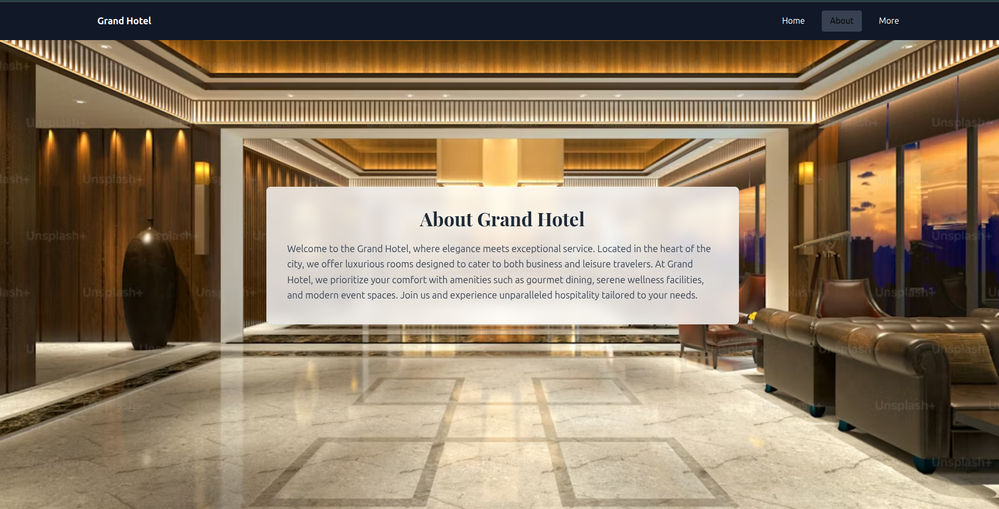
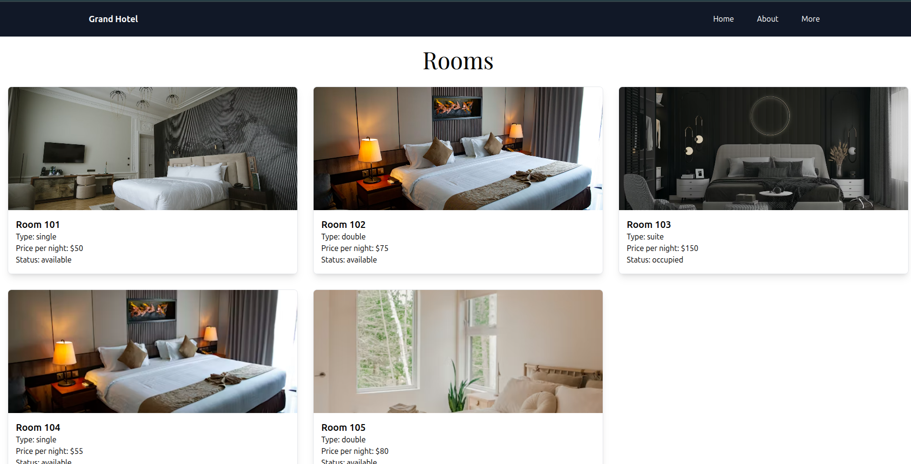

# 🏨 Grand Hotel - Hotel Reservation Management System

> A modern, full-stack hotel management platform featuring real-time room availability, secure booking workflows, and intuitive user experience.

[](your-live-demo-link)
[](https://github.com/Jeremy-3/Phase-2-Project)

## 📸 Screenshots

### Home Page

*Elegant landing page showcasing premium hotel services*

### About Section

*Luxurious hotel lobby with comprehensive service information*

### Room Catalog

*Real-time room availability with pricing and booking status*

---

## 🌟 Overview

Grand Hotel is a comprehensive hotel reservation system that streamlines the booking process for guests while providing powerful management tools for hotel staff. The platform features JWT-based authentication, real-time room availability tracking, and an intuitive interface for managing reservations.

### ✨ Key Features

- **🔐 Secure Authentication**: JWT-based user authentication with role-based access control
- **🏠 Real-Time Room Management**: Live availability tracking with automated status updates
- **📅 Smart Booking System**: Seamless reservation creation with conflict prevention
- **👥 Guest Management**: Complete guest profile system with booking history
- **📊 Admin Dashboard**: Comprehensive tools for managing rooms, reservations, and users
- **📱 Responsive Design**: Fully optimized for desktop, tablet, and mobile devices
- **🎨 Modern UI/UX**: Clean, intuitive interface built with Tailwind CSS

---

## 🚀 Quick Start

### Prerequisites

- Node.js (v14 or higher)
- npm or yarn

### Installation

1. **Clone the repository**
```bash
   git clone git@github.com:Jeremy-3/Phase-2-Project.git
   cd grand-hotel
```

2. **Install dependencies**
```bash
   npm install
```

3. **Configure environment variables**
```bash
   # Create .env file in root directory
   VITE_API_URL=http://localhost:5555
```

4. **Start development server**
```bash
   npm run dev
```

5. **Open your browser**
```
   Navigate to http://localhost:5173
```

---

## 🛠️ Technologies Used

### Frontend
- **React 18** - Modern component-based UI library
- **Tailwind CSS** - Utility-first CSS framework for responsive design
- **React Router v6** - Client-side routing and navigation
- **Vite** - Lightning-fast build tool and dev server

### Backend Integration
- **Fetch API** - HTTP requests for data management
- **JWT Authentication** - Secure token-based authentication
- **Flask REST API** - Backend service integration

---

## 📁 Project Structure
```
grand-hotel/
├── public/               # Static assets
├── src/
│   ├── components/       # Reusable React components
│   │   ├── Home.jsx     # Landing page
│   │   ├── About.jsx    # Hotel information
│   │   ├── Rooms.jsx    # Room catalog
│   │   ├── Login.jsx    # Authentication
│   │   └── ...
│   ├── styles/          # Global styles and Tailwind config
│   ├── utils/           # Helper functions and API calls
│   ├── App.jsx          # Main application component
│   └── main.jsx         # Application entry point
├── vite.config.js       # Vite configuration
└── package.json         # Project dependencies
```

---

## 🔌 API Integration

The frontend communicates with a Flask-based backend through the following RESTful endpoints:

| Endpoint | Method | Description |
|----------|--------|-------------|
| `/login` | POST | User authentication |
| `/register` | POST | New user registration |
| `/rooms` | GET | Fetch all available rooms |
| `/rooms` | POST | Create new room (admin) |
| `/reservations` | GET | Fetch all reservations |
| `/reservations` | POST | Create new reservation |
| `/guests` | GET | Fetch guest information |
| `/guests` | POST | Register new guest |

### Example API Call
```javascript
// Fetch available rooms
const fetchRooms = async () => {
  const response = await fetch('/api/rooms', {
    headers: {
      'Authorization': `Bearer ${token}`
    }
  });
  const data = await response.json();
  return data;
};
```

---

## 🎯 Core Functionality

### User Flows

**Guest Journey:**
1. Browse available rooms with pricing and amenities
2. Register/Login to create an account
3. Select room and dates for reservation
4. Complete booking with instant confirmation
5. View and manage existing reservations

**Admin Capabilities:**
1. Manage room inventory (create, update, delete)
2. View all reservations and guest information
3. Update room availability and pricing
4. Monitor booking analytics

---

## 🤝 Contributing

We welcome contributions! Here's how you can help:

1. **Fork the repository**
2. **Create a feature branch**
```bash
   git checkout -b feature/AmazingFeature
```
3. **Commit your changes**
```bash
   git commit -m 'Add some AmazingFeature'
```
4. **Push to the branch**
```bash
   git push origin feature/AmazingFeature
```
5. **Open a Pull Request**

### Development Guidelines

- Follow React best practices and hooks conventions
- Maintain Tailwind CSS utility-first approach
- Write clean, documented code
- Test thoroughly before submitting PRs

---

## 👨‍💻 Development Team

| Developer | Role | GitHub |
|-----------|------|--------|
| **Jeremy Gitau** | Lead Developer | [@Jeremy-3](https://github.com/Jeremy-3) |
| **Tony Maina** | Backend Developer | [@TonyMaina](https://github.com/TonyMaina) |
| **Keith Mwai** | Frontend Developer | [@KeithMwai](https://github.com/KeithMwai) |
| **Elvis Gitau** | UI/UX Developer | [@ElvisGitau](https://github.com/ElvisGitau) |
| **Franklin Ndegwa** | Full Stack Developer | [@FranklinNdegwa](https://github.com/FranklinNdegwa) |

---

## 📄 License

This project is licensed under the MIT License - see the [LICENSE](LICENSE) file for details.

---

## 🔗 Links

- **Live Demo**: [Grand Hotel Application](https://grand-hotel-chi.vercel.app/)
- **Backend Repository**: [Grand Hotel API](https://github.com/Jeremy-3/grand-hotel-backend)

---

## 📞 Support

For issues, questions, or contributions:
- Open an [issue](https://github.com/Jeremy-3/Phase-2-Project/issues)
- Email: jeremyhizashi@gmail.com

---

<div align="center">
  
**Built with ❤️ by the Grand Hotel Team**

⭐ Star this repo if you find it helpful!

</div>
